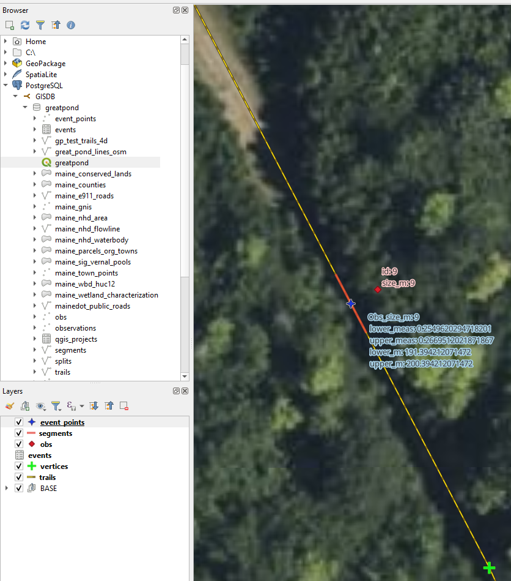

# Postgis linear referencing

Example SQL to demonstrate some linear referencing concepts using only PostGIS/Postgres. 

### Motivation
The goals is to demonstrate linear referencing and perform all processing, after collection of the initial observation file, in PostGIS alone. Next steps might be to enable some or all of this process to be dynamic so that event_points and segments would automatically adjust if the line layer is edited -- one of the beatiful aspects of linear referencing versus just creating features.


### Explanation of the geometric processing

The process requires two input Postgis layers each containing geometry (POINT and LINE) and a single user-provided attribute on the point layer. Other attributes can be recorded but are optional for geometric processing, The first input is a point layer of observations (perhaps collected by GPS or onscreen digitizing), or events, along linear features (road, stream, sidewalk, trail). The point layer requires a field containing a number that describes the size of the area/object being observed (pothole, stream bank erosion, cracked sidewalk, degraded trail). The size is recorded as a length from the center to the edge of the feature, and assumes the coordinate is the center of the feature. At this time the size units should be in the units of the coordinate reference system (CRS) for the layer. These must be linear distance units, not degrees of latitude/longitude as would be used for unprojected data. The second layer is of linear features -- lines of a trail in this example -- and must be in the same CRS as the point observation layer.

For example, hikers would stand at the center of a section of eroded trail and record the coordinates at the center of the eroded section. The CRS for the project is UTM and the position is recorded in meters. The hikers would record the full size of the problem region, which might be five (5.0) meters in this example.

### INPUTS

So, inputs here are 
 1. observations (obs POINT spatial table) 
 2. linear features (here called trails with LINESTRINGZM type, and it looks for fields trails_fid,   trails_osm_id, trail_length_m)
 
Adjust the fields in the SQL to match your inputs.

```
CREATE TABLE IF NOT EXISTS greatpond.obs
(
    id serial,
    name character varying(50),
    "desc" character varying(250),
    severity_int integer,
    size_m numeric NOT NULL,
--    geom geometry, -- we will load this field with POINTs, not MULTIPOINTs
    PRIMARY KEY (id)
);

COMMENT ON TABLE greatpond.obs
    IS 'Field observations';
	
		
	-- Add a spatial column to the table
	-- AddGeometryColumn(varchar schema_name, varchar table_name, 
	-- 		varchar column_name, integer srid, varchar type, integer dimension, boolean use_typmod=true);

SELECT AddGeometryColumn ('greatpond','obs','geom',6348,'POINT',2); -- EPSG:6348 - NAD83(2011) / UTM zone 19N
	
	CREATE INDEX obs_geom_idx
  ON greatpond.obs
  USING GIST (geom);
  
  ```

The process snaps the points to the nearest line (because it's impossible to collect coordinates exactly on a line) at the closest location possible (does not look for a vertex or node) and records the coordinates from that snapped location. This snapping process converts the observation (point features) to another point layer on the line layer to create an intermediate table called events. The events table brings along some other attributes that are interesting (dist_to_trail_m) and are needed to make the next layer here called segments (lower_m, upper_m, lower_meas, upper_meas). The events table is used to create an event_points layer, which is then used to make the final layer called segments (short for event segments).

### OUTPUTS

 1. events (tabular)
 2. event_points (POINTS)
 3. segments (LINESTRING)

### TESTING

Developed using QGIS 3.26 and Postgresql/PostGIS as below.


 * Ubuntu 22.04
 
 * output from SELECT PostGIS_full_version ();

```
POSTGIS="3.2.1 5fae8e5" [EXTENSION] PGSQL="130" GEOS="3.10.2-CAPI-1.16.0" PROJ="7.2.1" LIBXML="2.9.12" LIBJSON="0.15" LIBPROTOBUF="1.3.3" WAGYU="0.5.0 (Internal)"
```
### IMAGES


 Observation points would typically be collected by GPS in the field, but could be digitized as shown above.


The screen above shows many important elements. 


The screen above shows some example products. Notice the slight asymmetry in the measures on either side of the event point. 
