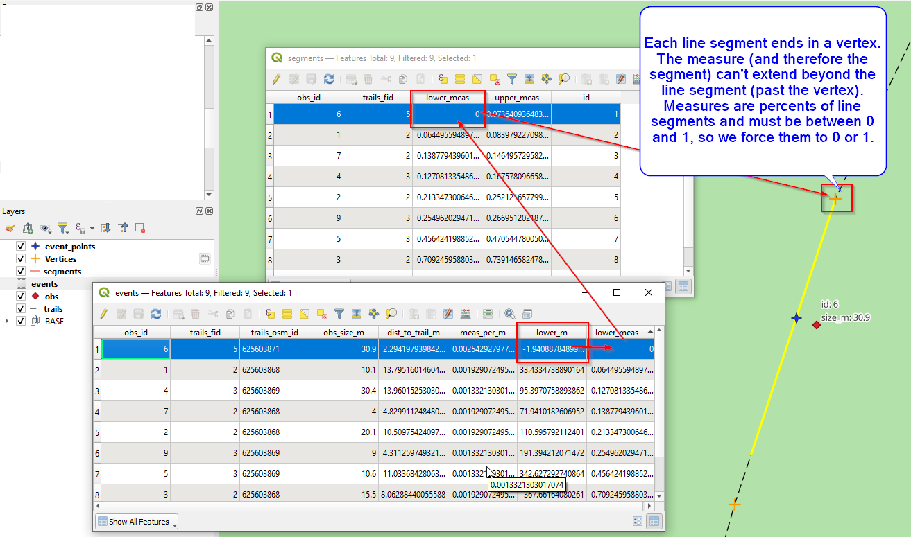

# Postgis linear referencing

Only in PostGIS. Tested in the following environment
 * Ubuntu 22.04
 
 * output from SELECT PostGIS_full_version ();

```
POSTGIS="3.2.1 5fae8e5" [EXTENSION] PGSQL="130" GEOS="3.10.2-CAPI-1.16.0" PROJ="7.2.1" LIBXML="2.9.12" LIBJSON="0.15" LIBPROTOBUF="1.3.3" WAGYU="0.5.0 (Internal)"
```
The goals is to perform all processing, after collection of the initial observation file, in PostGIS alone.


 Observation points would typically be collected by GPS in the field, but could be digitized as shown above.


The screen above shows many important elemets. 